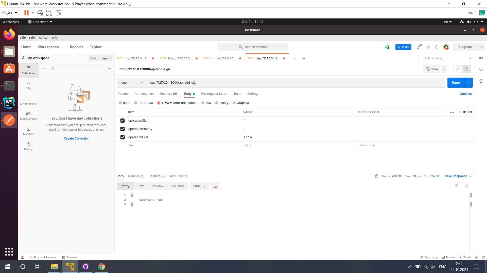

## UPDATE END

Добавлены роуты и контроллеры для api, с JWT авторизацией, передача токена в заголовке(токен ещё можно засунуть в бд)

Для добовления своей операции необходимо сделать запрос, который добавит операцию в класс  
myOperator =  Символ оператора  
myPriority = Приоритет операции  
resultOperations = Как интерпретировать операцию относительно 2 переменных a и b 

### Пример добавления операции
В заголовке передаём токен

